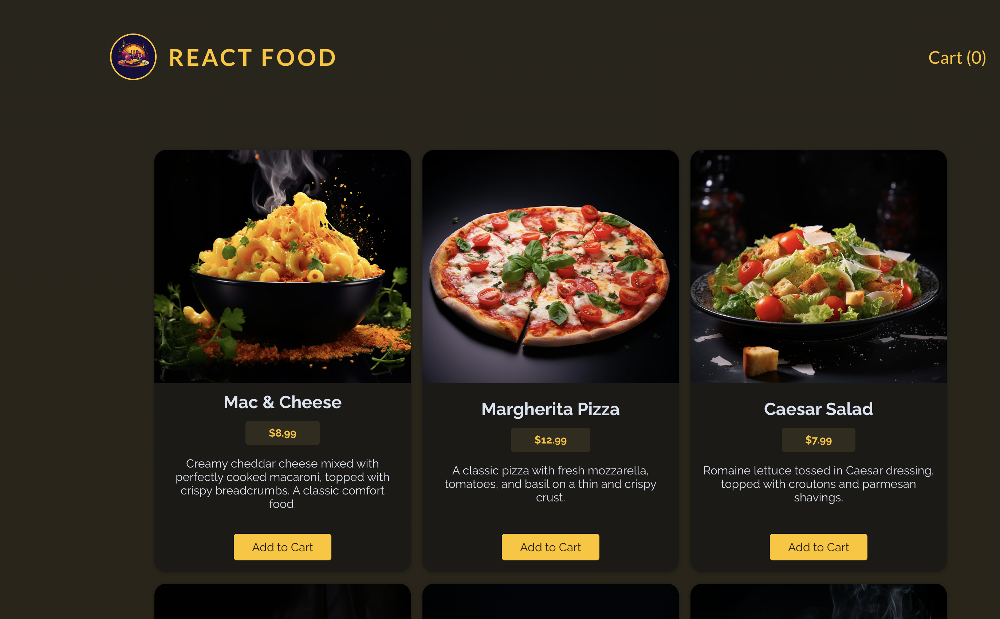
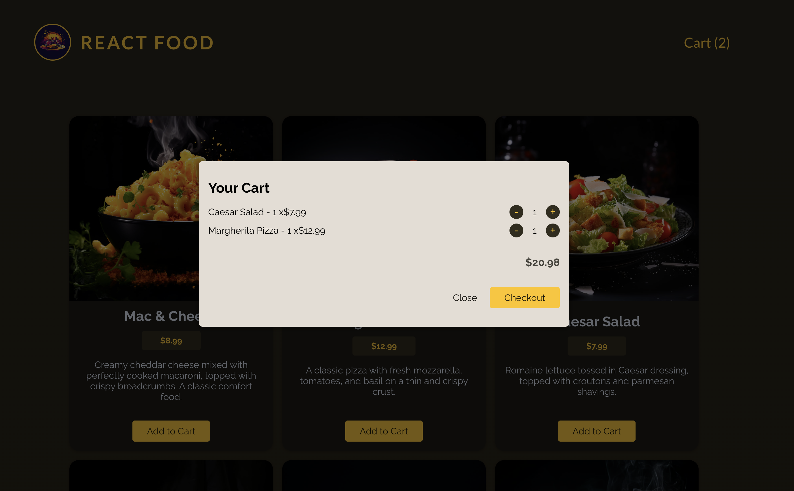

# Food Ordering App

This project is a web-based food ordering application built with React. It allows users to browse through a selection of food items, add them to their cart, and place orders. The application fetches data from a backend API written in Node.js.

## Features

- Browse through a selection of food items.
- Add items to the cart.
- View and modify the cart contents.
- Place orders.

## Technologies Used

- React: Frontend framework for building user interfaces.
- Node.js: Backend runtime environment.
- Express.js: Web application framework for Node.js.
- MongoDB: NoSQL database for storing food items, user information, and order history.
- Axios: HTTP client for making requests to the backend API.

## Getting Started

To run this project locally, follow these steps:

1. Clone the repository:

\`\`\`bash
git clone https://github.com/sehaj23/food-ordering-application-react.git
\`\`\`

2. Navigate to the project directory:

\`\`\`bash
cd food-ordering-app
\`\`\`

3. Install dependencies:

\`\`\`bash
npm install
\`\`\`

4. Start the development server:

\`\`\`bash
npm run dev
\`\`\`

5. The application should now be running on \`http://localhost:5173\`.

## Configuration

Make sure to configure the backend API URL in the frontend code. By default, it is set to \`http://localhost:8000\`.

\`\`\`javascript
// src/config.js

const API_URL = 'http://localhost:8000/api';
\`\`\`

## API Endpoints

- \`/api/fooditems\`: Get a list of food items.
- \`/api/cart\`: Get cart contents, add items to the cart, or remove items from the cart.
- \`/api/orders\`: Place orders and retrieve order history.

## Contributing

Contributions are welcome! Feel free to open an issue or submit a pull request.

## License

This project is licensed under the MIT License. See the [LICENSE](LICENSE) file for details.
EOF

## Screenshots

